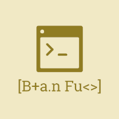

# Brain Fuck Toolbox
Welcome!
This is a toolbox for programming and building in Brainfuck.
Brainfuck is an esoteric programming language with 8 simple commands.
For more information please visit this [awesome](https://gist.github.com/roachhd/dce54bec8ba55fb17d3a) tutorial.
This is simply a poorly made Brainfuck compiler and interpreter.

## Dependencies
* A C/C++ compiler (gcc, g++, msvc, msys, etc.)
* *Optional:* CMake

This tutorial will use gcc.

## How to Build
### CMake (recommended)
In a terminal or command prompt, run:
```bash
cmake *
```
This should build the makefiles for your operating system.
Once this happens, you should be able to build with make.
This now provides two make options.

#### BFtoC Compiler
To build the BFtoC compiler, run:
```bash
make bftoc
```
This will create the bftoc executable.

#### BF Interpreter
To build the BF Interpreter, run:
```bash
make bfinterpreter
```

### Manual Build
You simply need to build the desired file with your compiler.
For instance, if you want to build the bftoc with gcc, run:
```bash
gcc bftoc.cpp -o bftoc
```
You can also build the BF Interpreter with:
```bash
gcc bfinterpreter.cpp -o bfinterpreter
```

## How to use
There are two pieces to the BF Toolkit so far: the BFtoC & the BF Interpreter.

### BF Interpreter
The BF Interpreter is a very poorly written interpreter.
Once compiled, run the executable such as:
```bash
./bfinterpreter /path/to/bfcode.bf
```
to run the interpreter.

The interpreter will read any `.bf` file.
It actually works quite well for simple applications and is pretty speedy.
However because I'm a garbo programmer it fails all tests set by [Daniel Cristofani](http://www.hevanet.com/cristofd/brainfuck/tests.b).
It will work pretty well but is liable to break.
For these reasons I recommend the bftoc.

### BFtoC
The bftoc is a more robust pseudo-compiler for Brainfuck.
I call it a pseudo compiler as it doesn't really compile anything.
What the bftoc does is translate Brainfuck code to C.
That way, your Brainfuck code is super portable and easily compiled.

To use the bftoc, run:
```bash
./bftoc /path/to/bfcode.bf
```
The following code with prompt you for the output filename.
It **will** create a new file or overwrite an existing one.
The bftoc will default to `a.c` as its filename if one is not provided.
Once it has finished, the program will say so.

You can then build the C program as you would any other.
For instance, you can build with:
```bash
gcc a.c -o myBFProgram
```
and run the executable with
```bash
./myBFProgram
```
The bftoc is very robust and passes all test set by [Daniel Cristofani](http://www.hevanet.com/cristofd/brainfuck/tests.b)
(to a degree; the range tests don't cause segfaults but may make a mess).
Overall, I think that the bftoc is the superior toolset but is more heavy and difficult.

## Examples
Two example files have been provided with the toolkit: `example.c` and `example.bf`.
`example.bf` is a "Hello World!" program written in Brainfuck, with `example.c` being the output from bftoc.
These are guaranteed to work and output "Hello World!" should everything be built properly.

## Other

### Contributing
Why?
This is the stupidest thing.
Like I made this and find it so stupid.
Whatever.
Please use normal open source etiquette.

### License
This project is licensed with the MIT license.